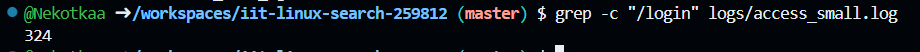
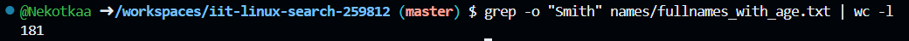
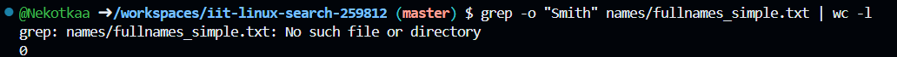
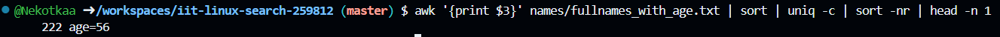
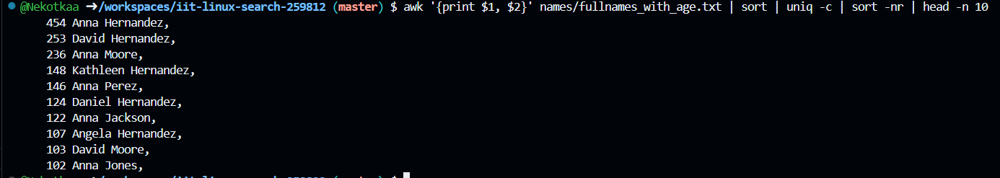
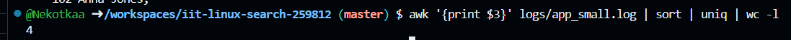
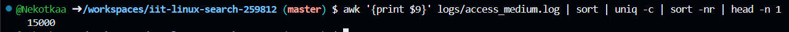
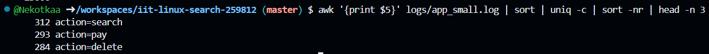
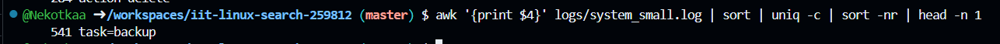

> This is the demonstration how to use Linux commands to process strutured text data.

### 0. How many lines are in fullnames_with_age.txt?

Put screenshot from Codespaces illustrating the result here.
Correct screenshot should contain your github username in the shell, a command and the result.

Example:

**Explanation** Write the explanation why the specific command was used.

Example: wc command is to count data in a given file. -l parameter is for counting lines.

### 1. How many lines in access_small.log have path /login?

**Explanation**: 
grep -c searches for the text /login and simply counts the matching lines in the log file.

---

### 2. How many occurrences of Smith are in fullnames_with_age.txt?

**Explanation**: 
grep -o finds every single time Smith appears. wc -l then counts all of those occurrences.

### 3. How many occurrences of Smith are in fullnames_simple.txt?

**Explanation**: 
grep -o finds all instances of Smith, and wc -l counts them.

### 4. Which age is most frequent in fullnames_with_age.txt?

**Explanation**: 
awk '{print $3}': Isolates the age (third column).; 
sort | uniq -c: Groups identical ages and counts them.; sort -nr | head -n 1: Finds the count that is highest and shows the top result.

### 5. Show the 10 most common names (first+last) in fullnames_with_agetxt.

**Explanation**: 
awk '{print $1, $2}': Isolates the first and last names.;
sort | uniq -c: Groups identical names and counts them.; 
sort -nr | head -n 10: Finds the 10 highest counts and shows the top 10 names.

### 6. How many unique users are in app_small.log?

**Explanation**: awk '{print $3}': Isolates the User ID (third column).; 
sort | uniq: Removes all duplicate IDs.; 
wc -l: Counts the remaining unique IDs.

### 7. Which status code appears most often in access_medium.log? 

**Explanation**: 
awk '{print $9}': Isolates the Status Code (ninth column).; 
sort | uniq -c: Counts the frequency of each code.; 
sort -nr | head -n 1: Finds the highest count and shows the most frequent status code.

### 8. What is the top 3 most common modules in app_small.log?

**Explanation**: 
awk '{print $5}': Isolates the Module Name (fifth column).; 
sort | uniq -c: Counts the frequency of each module.; 
sort -nr | head -n 3: Finds the 3 highest counts and shows the top 3 modules.

### 9. Which task appears most often in system_small.log?

**Explanation**: 
awk '{print $4}': Isolates the Task Name (fourth column).; 
sort | uniq -c: Counts the frequency of each task.; 
sort -nr | head -n 1: Finds the highest count and shows the most frequent task.

### Source used.

**LinuxCommand.org&**