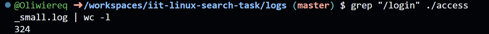

> This is the demonstration how to use Linux commands to process strutured text data.

### 0. How many lines are in fullnames_with_age.txt?

Put screenshot from Codespaces illustrating the result here.
Correct screenshot should contain your github username in the shell, a command and the result.

Example:

**Explanation** Write the explanation why the specific command was used.

Example: wc command is to count data in a given file. -l parameter is for counting lines.

### 1. How many lines in access_small.log have path /login?

**Explanation** The grep command searches for patterns. The -c counts the number of lines that contain the specified pattern (/login).

---

### 2. How many occurrences of Smith are in fullnames_with_age.txt?

**Explanation** The grep -o "Smith" command searches for the pattern (Smith) and prints only the matching occurrences. This output is then piped (|) to wc -l, which counts these lines, giving the total number of occurrences.

### 3. How many occurrences of Smith are in fullnames_simple.txt?

**Explanation** Similar to point 2, grep -o isolates each instance of Smith, and wc -l counts them.

### 4. Which age is most frequent in fullnames_with_age.txt?

**Explanation** awk '{print $3}': Extracts the third column ($3), which is assumed to contain the age.

| sort: Sorts the ages to group identical values together.

| uniq -c: Counts (-c) the frequency of each unique age.

| sort -nr: Sorts the result numerically (-n) and in reverse order (-r), putting the most frequent age at the top.

| head -n 1: Displays only the top line.

### 5. Show the 10 most common names (first+last) in fullnames_with_agetxt.

**Explanation** awk '{print $1, $2}': Extracts the first ($1) and second ($2) columns (first and last name).

| sort: Sorts the full names to group identical names.

| uniq -c: Counts (-c) the frequency of each unique full name.

| sort -nr: Sorts the result numerically and in reverse, putting the most common names at the top.

| head -n 10: Displays the top 10 lines (the 10 most common names).

### 6. How many unique users are in app_small.log?

**Explanation** awk '{print $4}': Extracts the user ID (assuming it is the third column, $3).

| sort | uniq: Sorts the IDs and then filters them to keep only unique occurrences.

| wc -l: Counts the number of lines, which represents the number of unique users.

### 7. Which status code appears most often in access_medium.log? 

**Explanation** awk '{print $9}': Extracts the HTTP status code (assuming it's the ninth column, $9, in a standard log format).

| sort | uniq -c: Sorts and then counts the frequency of each unique status code.

| sort -nr | head -n 1: Sorts the counts in descending order and displays the most frequent status code.

### 8. What is the top 3 most common modules in app_small.log?

**Explanation** awk '{print $5}': Extracts the module name (assuming it is the fifth column, $5).

| sort | uniq -c: Sorts the modules and counts their occurrences.

| sort -nr: Sorts the counts in descending order.

| head -n 3: Displays the top 3 most frequent modules.

### 9. Which task appears most often in system_small.log?

**Explanation** awk '{print $4}': Extracts the task name (assuming it is the fourth column, $4).

The rest of the pipeline (| sort | uniq -c | sort -nr | head -n 1) sorts, counts the unique tasks, sorts the counts in reverse order, and outputs the single most frequent task.
