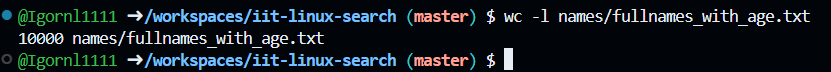
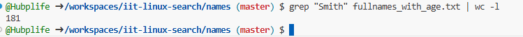
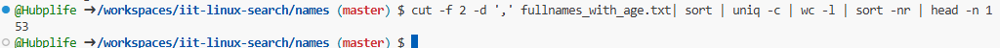
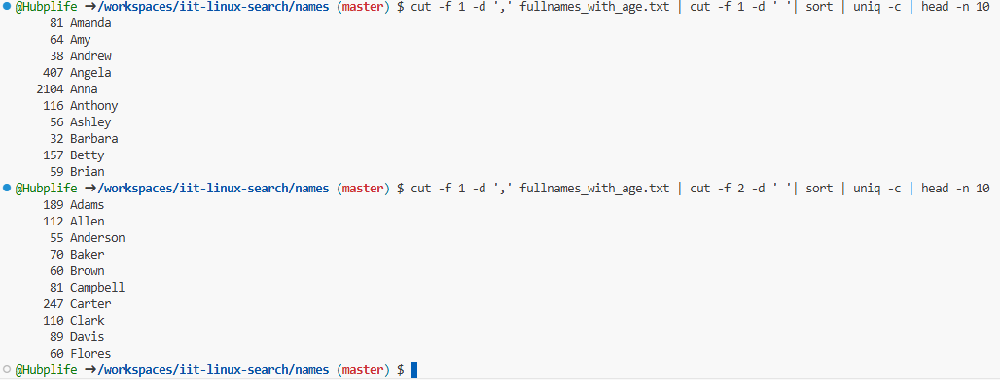
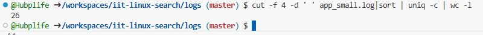
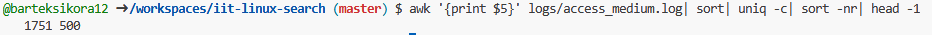
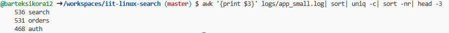
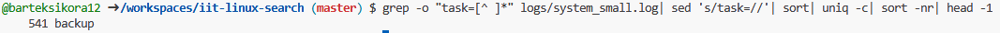

> This is the demonstration how to use Linux commands to process strutured text data.

### 0. How many lines are in fullnames_with_age.txt?

Put screenshot from Codespaces illustrating the result here.
Correct screenshot should contain your github username in the shell, a command and the result.

Example:

**Explanation** Write the explanation why the specific command was used.

Example: wc command is to count data in a given file. -l parameter is for counting lines.

### 1. How many lines in access_small.log have path /login?

**Explanation**

grep - searches through text 
- c - counts what grep searches 

### 2. How many occurrences of Smith are in fullnames_with_age.txt?

**Explanation**

grep - searches through text 
- c - counts what grep searches

### 3. How many occurrences of Smith are in fullnames_simple.txt?

**Explanation**
There is no such file ass fullnames_simple.txt 

### 4. Which age is most frequent in fullnames_with_age.txt?

**Explanation**

grep -o "age=[0-9]*" - extract age column

sed 's/age=//' - removes the age= part, leaving just the number

sort - sort before counting

unniq -c - counts occurrences

sort -nr - sorts by count

head -1 - shows the most frequent age 

### 5. Show the 10 most common names (first+last) in fullnames_with_agetxt.

**Explanation**

sed 's/,.*//' - removes comma and everything after it

sort - sorts names alphabetically 

uniq -c - counts duplicates

sort -nr - sorts by count

head -10 - shows the top 10 most common names

### 6. How many unique users are in app_small.log?

**Explanation**

grep -o "user=[^ ]*" - extract user field 

sed 's/user=//' - leaves only user id 

sort -u - keeps only unique usernames

wc -1 - counts them 

### 7. Which status code appears most often in access_medium.log? 

**Explanation**

awk '{print $5}' - extract 5th column 

sort - sort alphabetically

uniq - c - counts duplicates

sort -nr - sort descending

head -1 - show first line

### 8. What is the top 3 most common modules in app_small.log?

**Explanation** 

awk '{print $3}' - extracts module field

sort - sort alphabetically

uniq -c - count unique modules

sort -nr - sort counts highest first 

head -3 - shows top3 

### 9. Which task appears most often in system_small.log?

**Explanation** 

grep -o "task=[^ ]*" - extracts task column

sed 's/task=//' - remove task word

sort -nr - short by highest count

head - 1 - shows the most frequent task 

