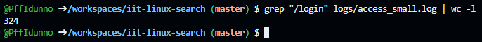
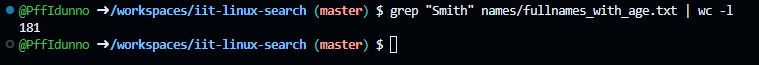
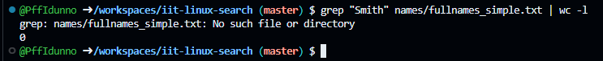
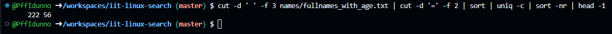
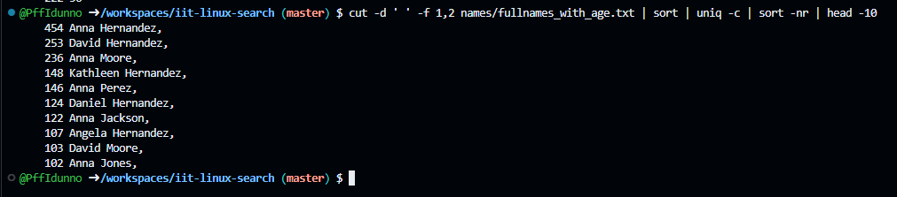
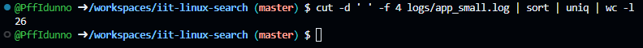
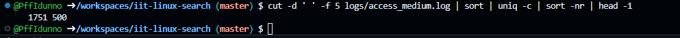
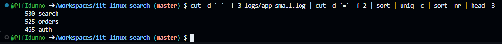
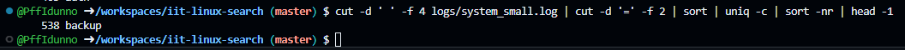

> This is the demonstration how to use Linux commands to process strutured text data.

### 0. How many lines are in fullnames_with_age.txt?

Put screenshot from Codespaces illustrating the result here.
Correct screenshot should contain your github username in the shell, a command and the result.

Example:

**Explanation** Write the explanation why the specific command was used.

Example: wc command is to count data in a given file. -l parameter is for counting lines.

---

### 1. How many lines in access_small.log have path /login?

**Explanation** grep filters lines containing /login, and wc -l counts the resulting lines

---

### 2. How many occurrences of Smith are in fullnames_with_age.txt?

**Explanation** grep filters for "Smith", wc same as task 1

---

### 3. How many occurrences of Smith are in fullnames_simple.txt?

**Explanation** Same as task 2. but since selected file doesn't exists grep returns error and wc returns 0.

---

### 4. Which age is most frequent in fullnames_with_age.txt?

**Explanation** cut extracts the age field, which is then separated from age= with second cut. sort orders the data, uniq -c counts frequencies, and sort -nr ranks results (reverse numerical sort) to find the top entry (head -1).

---

### 5. Show the 10 most common names (first+last) in fullnames_with_agetxt.

**Explanation** cuts same as task 4 sort | uniq -c counts the frequency of each unique name. sort -nr ranks them by count, and head -10 displays the top 10.

---

### 6. How many unique users are in app_small.log?

**Explanation** cut extracts the user field. The output is sorted, uniq removes duplicates, and wc -l counts the remaining unique lines

---

### 7. Which status code appears most often in access_medium.log? 

**Explanation** cut extracts the status code field. The output is processed by sort | uniq -c for frequency counting, and sort -nr | head -1 finds the highest frequency result

---

### 8. What is the top 3 most common modules in app_small.log?

**Explanation** cuts same as task 4. sort | uniq -c counts occurrences. sort -nr ranks them, and head -3 shows the top 3.

---

### 9. Which task appears most often in system_small.log?

**Explanation** cuts same as task 4. sort | uniq -c counts the frequencies, and sort -nr | head -1 identifies the most common task.

---
