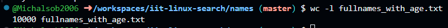
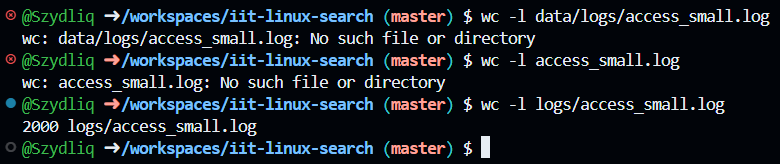
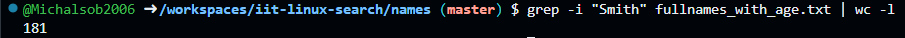
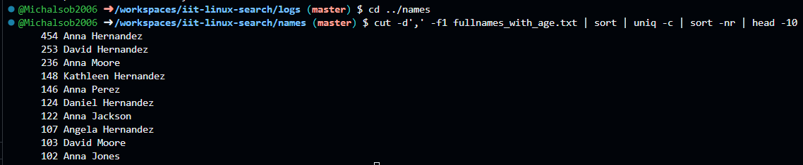
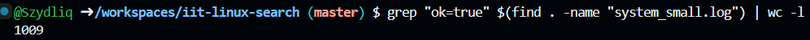
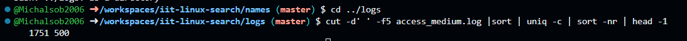
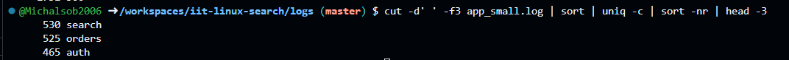
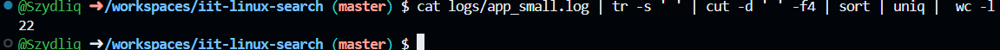

> This is the demonstration how to use Linux commands to process strutured text data.

### 0. How many lines are in fullnames_with_age.txt?

Put screenshot from Codespaces illustrating the result here.
Correct screenshot should contain your github username in the shell, a command and the result.

**Explanation** 
wc -l counts the lines in the file

### 1. How many lines in access_small.log have path /login?

Put screenshot from Codespaces illustrating the result here.
Correct screenshot should contain your github username in the shell, a command and the result.

**Explanation** Write the explanation why the specific command was used.
grep finds lines with /login and wc -l count them.

---

### 2. How many occurrences of Smith are in fullnames_with_age.txt?

Put screenshot from Codespaces illustrating the result here.
Correct screenshot should contain your github username in the shell, a command and the result.

**Explanation** Write the explanation why the specific command was used.
grep -i finds "Smith", wc -l counts the matches.

### 4. Which age is most frequent in fullnames_with_age.txt?

Put screenshot from Codespaces illustrating the result here.
Correct screenshot should contain your github username in the shell, a command and the result.

**Explanation** Write the explanation why the specific command was used.

awk gets the last word (age), cut removes "age=", sort -n orders numbers for grouping, uniq -c counts occurrences, sort -nr sorts by frequency, head-1 shows top result

### 5. Show the 10 most common names (first+last) in fullnames_with_agetxt.

Put screenshot from Codespaces illustrating the result here.
Correct screenshot should contain your github username in the shell, a command and the result.

**Explanation** Write the explanation why the specific command was used.
cut extracts the name column, sort orders them for grouping, inq -c counts duplicates, sort -nr sorts by frequency, head -10 ists top 10.

### 6. How many unique users are in app_small.log?

Put screenshot from Codespaces illustrating the result here.
Correct screenshot should contain your github username in the shell, a command and the result.

**Explanation** Write the explanation why the specific command was used.

grep -o extracts only the usnername text, sort -u sorts and removes duplicates and wc -l count the remaining unique users

### 7. Which status code appears most often in access_medium.log? 

Put screenshot from Codespaces illustrating the result here.
Correct screenshot should contain your github username in the shell, a command and the result.

**Explanation** Write the explanation why the specific command was used.

cut extracts the status code, sort groups them, uniq -c counts the frequency, osrt -nr sorts by count descending, head -1 shows the most frequent code

### 8. What is the top 3 most common modules in app_small.log?

Put screenshot from Codespaces illustrating the result here.
Correct screenshot should contain your github username in the shell, a command and the result.

**Explanation** Write the explanation why the specific command was used.
cut extracts the modul name, sort groups them, uniq -c counts the frequency, sort -nr sorts by coun descending, head -3 shows top 3 moduls.

### 9. Which task appears most often in system_small.log?

Put screenshot from Codespaces illustrating the result here.
Correct screenshot should contain your github username in the shell, a command and the result.

**Explanation** Write the explanation why the specific command was used.
grep finds task lines, cut extracts the task part, cut removes "task=", sort groups them, uniq -c counts occurrences, sort -nr orders by frequency, head -1 shows the winner.