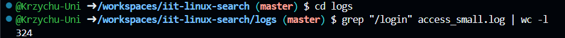
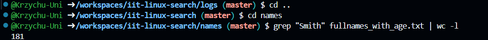
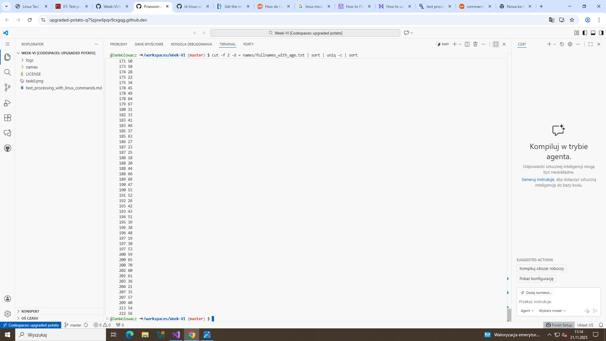
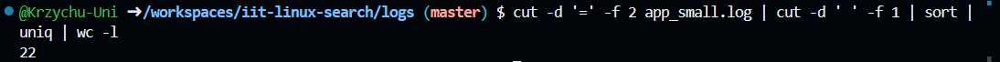
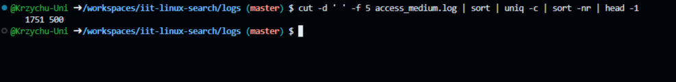
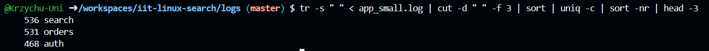
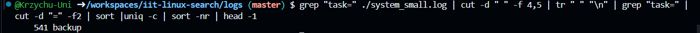

> This is the demonstration how to use Linux commands to process strutured text data.

### 0. How many lines are in fullnames_with_age.txt?

Put screenshot from Codespaces illustrating the result here.
Correct screenshot should contain your github username in the shell, a command and the result.

Example:

**Explanation** Write the explanation why the specific command was used.

Example: wc command is to count data in a given file. -l parameter is for counting lines.

### 1. How many lines in access_small.log have path /login?

**Explanation** Write the explanation why the specific command was used.

Grep filters the file for lines with /login. The | passes these results to wc -l, which counts the line total

### 2. How many occurrences of Smith are in fullnames_with_age.txt?

**Explanation** Write the explanation why the specific command was used.

Grep finds all lines containing "Smith". The | passes these results to wc -l to count the lines.
### 3. How many occurrences of Smith are in fullnames_simple.txt?

File does not exist.

**Explanation** Write the explanation why the specific command was used.
File does not exist.

### 4. Which age is most frequent in fullnames_with_age.txt?

**Explanation** Write the explanation why the specific command was used.

Cut extracts the age field. Sort sorts the data (sort -nr), and head -1 shows the result.
### 5. Show the 10 most common names (first+last) in fullnames_with_agetxt.

**Explanation** Write the explanation why the specific command was used.

Cut isolates the names, sort sorts the data, and head -10 displays the top ten
### 6. How many unique users are in app_small.log?

**Explanation** Write the explanation why the specific command was used.

Cut commands extract and clean the User ID. The IDs are sorted, and uniq removes duplicates. Finally, wc -l displays the result.
### 7. Which status code appears most often in access_medium.log? 

**Explanation** Write the explanation why the specific command was used.

Cut isolates the status code, sort sorts the list than Uniq -c: counts duplicate status codes after that sort -nr: which sorts the counts numerically (-n) in reverse (-r) order to put the highest frequency first, and head -1 shows the result.

### 8. What is the top 3 most common modules in app_small.log?

**Explanation** Write the explanation why the specific command was used.

Tr -s " " squeezes repeated spaces (there are double spaces in the source file), cut -d " " -f 3 extracts the third field, sort orders the values, uniq -c counts occurrences, sort -nr sorts counts from highest to lowest, and head -3 shows the top three results.
### 9. Which task appears most often in system_small.log?

**Explanation** Write the explanation why the specific command was used.

Grep "task=" filters lines containing task entries, cut -d " " -f 4,5 keeps only fields 4 and 5, tr " " "\n" puts each field on a new line, the second grep "task=" isolates only task fields, cut -d "=" -f2 extracts the task value, sort orders them, uniq -c counts occurrences, sort -nr ranks them highest first, and head -1 displays the result.
