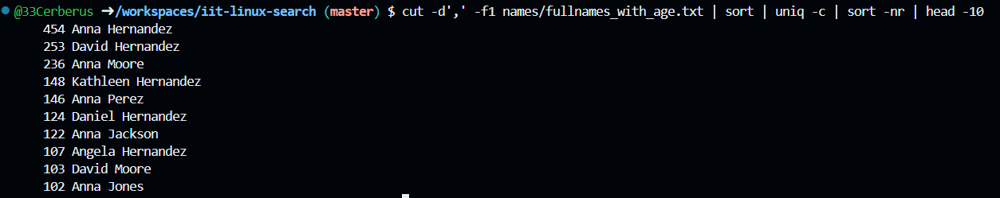

> This is the demonstration how to use Linux commands to process strutured text data.

### 0. How many lines are in fullnames_with_age.txt?

Put screenshot from Codespaces illustrating the result here.
Correct screenshot should contain your github username in the shell, a command and the result.

Example:

**Explanation** Write the explanation why the specific command was used.

Example: wc command is to count data in a given file. -l parameter is for counting lines.

### 1. How many lines in access_small.log have path /login?

**Explanation** grep "/login" access_small.log
Searches all lines in the file access_small.log that contain the substring /login. 
| (pipe) Sends the matching lines to the next command.
wc -l Counts the number of lines received from grep.

### 2. How many occurrences of Smith are in fullnames_with_age.txt?

**Explanation** the commands is nearly the same as the previous one, only now I search for "Smith" substring and use -o to count different occurrences on the same line

### 3. How many occurrences of Smith are in fullnames_simple.txt?

**Explanation** The file doesn't exist

### 4. Which age is most frequent in fullnames_with_age.txt?

**Explanation** 

awk '{print $NF}' fullnames_with_age.txt

NF = "number of fields"

$NF = the last field on the line

In this file, the age is the last value, so this extracts only ages.

sort

Sorts all ages so duplicates are next to each other.

uniq -c

Counts how many times each age appears.

sort -nr

Sorts numerically (-n) and in reverse order (-r)

So the most frequent age appears first.

head -1

Shows only the top result → the most common age.

### 5. Show the 10 most common names (first+last) in fullnames_with_age.txt?

**Explanation** 
cut -d',' -f1 fullnames_with_age.txt

Uses , as a delimiter

Extracts the first field → the full name (FirstName LastName)

sort

Sorts names alphabetically → duplicates are grouped together

uniq -c

Counts how many times each name appears

sort -nr

Sorts by count descending → most frequent names first

head -10

Shows the top 10 most common full names

### 6. How many unique users are in app_small.log?

**Explanation** 
awk '{for(i=1;i<=NF;i++) if ($i ~ /^user=/) print $i}'

Loops through each field in the line

Prints the field if it starts with user= → extracts all users

sort → sorts all users so duplicates are grouped

uniq → removes duplicates → keeps only unique users

wc -l → counts how many unique users

### 7. Which status code appears most often in access_medium.log? 

**Explanation** 
awk '{print $5}' → extracts the status code field.

sort → groups identical status codes together.

uniq -c → counts occurrences of each status code.

sort -nr → sorts counts descending.

head -1 → outputs the most frequent status code.

### 8. What is the top 3 most common modules in app_small.log?

**Explanation** 
awk '{print $3}' app_small.log

Splits each line into fields (space-separated by default)

$3 = the module name field in app_small.log

Extracts only the module names from the log

sort

Sorts module names so duplicates are grouped together

uniq -c

Counts how many times each module appears

sort -nr

Sorts the counts numerically and in reverse order

Most frequent modules come first

head -3

Shows only the top 3 modules

### 9. Which task appears most often in system_small.log?

P

**Explanation** 
awk '{for(i=1;i<=NF;i++) if ($i ~ /^task=/) print $i}' system_small.log

Splits each line into fields ($1, $2, ...)

Loops through all fields (for(i=1;i<=NF;i++))

Prints the field if it starts with task=

This extracts all tasks from the log

sort

Sorts tasks alphabetically so that duplicates are grouped together

uniq -c

Counts how many times each task occurs

sort -nr

Sorts the counts numerically and in descending order → most frequent task appears first

head -1

Shows only the top (most frequent) task
