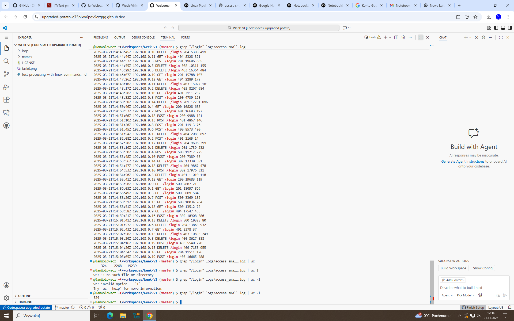
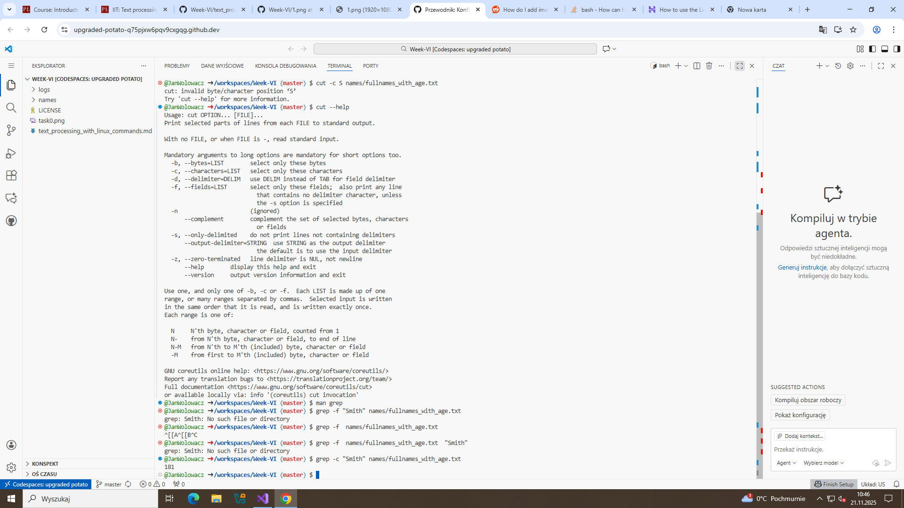
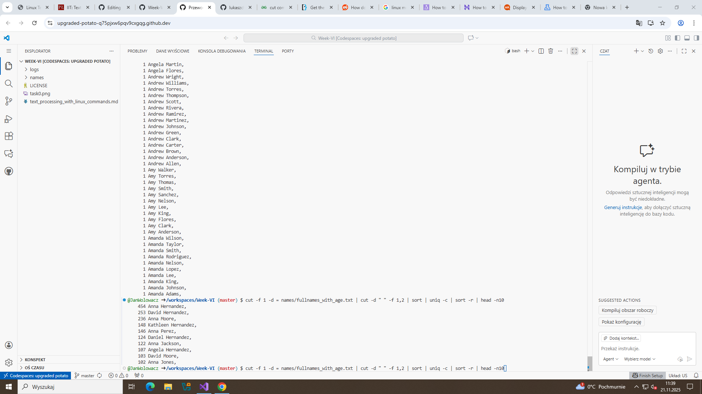
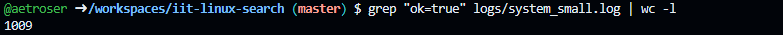
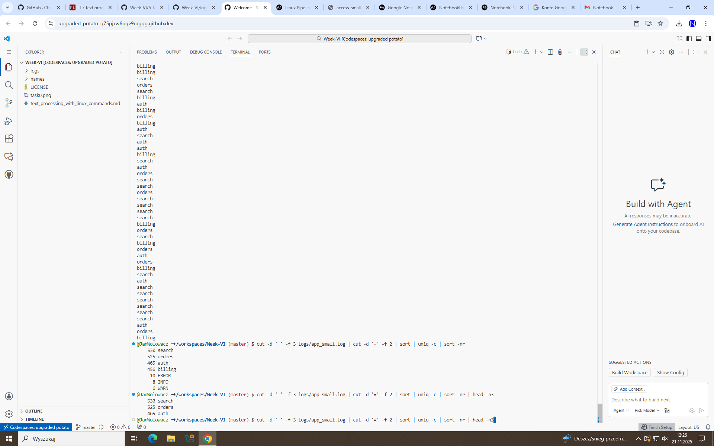
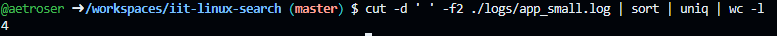

> This is the demonstration how to use Linux commands to process strutured text data.

### 0. How many lines are in fullnames_with_age.txt?

Put screenshot from Codespaces illustrating the result here.
Correct screenshot should contain your github username in the shell, a command and the result.

Example:

**Explanation** Write the explanation why the specific command was used.

Example: wc command is to count data in a given file. -l parameter is for counting lines.

### 1. How many lines in access_small.log have path /login?

**Explanation** Used grep to find keyword then just used wc to count them.

---

### 2. How many occurrences of Smith are in fullnames_with_age.txt?

Put screenshot from Codespaces illustrating the result here.
Correct screenshot should contain your github username in the shell, a command and the result.

**Explanation** Write the explanation why the specific command was used.

### 3. How many occurrences of Smith are in fullnames_simple.txt?

**Explanation** Grep command finds Smiths

### 4. Which age is most frequent in fullnames_with_age.txt?

**Explanation** Cut everything but age, sort, count them all and sort again. The greatest value is visible at the bottom.

### 5. Show the 10 most common names (first+last) in fullnames_with_agetxt.

**Explanation** Cut out age numbers, cut the word age itself. We don't need to cut off coma, because it is the same for every name,so we can just count unique lines, sort them in reverse and head -f10, so we show first 10 lines.

### 6. How many unique users are in app_small.log?

**Explanation** Cut out users, sorted displayed by uniq and then counted by wc

### 7. Which status code appears most often in access_medium.log? 

**Explanation** Took out status codes, sorted, counted uniquely and sorted again then shown only one output.

### 8. What is the top 3 most common modules in app_small.log?

**Explanation** Took out modules cut command and then sorted. After, counted unique output, sorted again and displayed only 3 of them.

### 9. Which task appears most often in system_small.log?

**Explanation** Again, cut out what we need, sorted, counted for unique output, sorted and displayed only one output.
