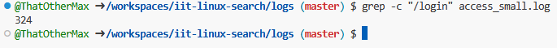
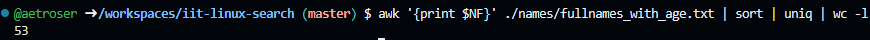
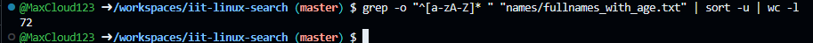
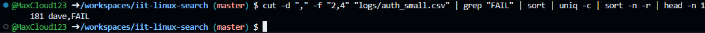
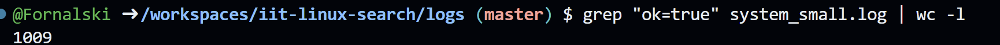
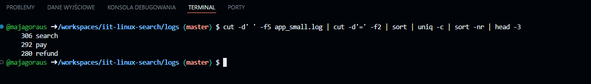
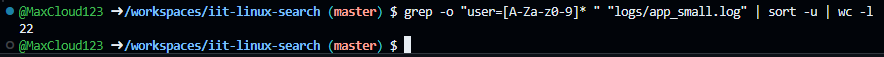

> This is the demonstration how to use Linux commands to process strutured text data.

### 0. How many lines are in fullnames_with_age.txt?

Put screenshot from Codespaces illustrating the result here.
Correct screenshot should contain your github username in the shell, a command and the result.

Example:

**Explanation** Write the explanation why the specific command was used.

Example: wc command is to count data in a given file. -l parameter is for counting lines.

### 1. How many lines in access_small.log have path /login?

Put screenshot from Codespaces illustrating the result here.
Correct screenshot should contain your github username in the shell, a command and the result.

**Explanation** Write the explanation why the specific command was used.

This command is used because grep "/login" finds all lines with /login, and wc -l counts them, so it shows how many times /login appears in the file.
---

### 2. How many different ages are in fullnames_with_age.txt?

Put screenshot from Codespaces illustrating the result here.
Correct screenshot should contain your github username in the shell, a command and the result.

**Explanation** Write the explanation why the specific command was used.

This command takes the ages from the file, sorts them, removes duplicates, and counts how many different ages there are.
---

### 3. How many unique first names are in fullnames_with_age.txt?

Put screenshot from Codespaces illustrating the result here.
Correct screenshot should contain your github username in the shell, a command and the result.

**Explanation** Write the explanation why the specific command was used.

The command cut -d' ' -f1 filename | sort | uniq | wc -l gets all first names from the file, filters out repeats, and shows the total number of unique names.
---

### 4. Which age is most frequent in fullnames_with_age.txt?

Put screenshot from Codespaces illustrating the result here.
Correct screenshot should contain your github username in the shell, a command and the result.

**Explanation** Write the explanation why the specific command was used.

This command takes the ages, counts how many times each appears, sorts them by frequency, and shows the age that appears most.
---

### 5. Which username failed login most often in auth_small.csv?

Put screenshot from Codespaces illustrating the result here.
Correct screenshot should contain your github username in the shell, a command and the result.

**Explanation** Write the explanation why the specific command was used.

This command finds all failed logins, extracts the usernames, counts how many times each failed, and shows the one that failed most.
---

### 6. How many lines in system_small.log have ok=true?

Put screenshot from Codespaces illustrating the result here.
Correct screenshot should contain your github username in the shell, a command and the result.

**Explanation** Write the explanation why the specific command was used.

This command finds all lines containing ok=true in the file and counts how many there are.
---

### 7, Which level (INFO, WARN, ERROR) appears most often in system_small.log?

Put screenshot from Codespaces illustrating the result here.
Correct screenshot should contain your github username in the shell, a command and the result.

**Explanation** Write the explanation why the specific command was used.

This command extracts the log levels from each line, counts how many times each appears, and shows the one that occurs most often.
---

### 8. What is the top 3 most common actions in app_small.log?

Put screenshot from Codespaces illustrating the result here.
Correct screenshot should contain your github username in the shell, a command and the result.

**Explanation** Write the explanation why the specific command was used.

The command pipeline extracts the action name from the log file, uses sort and uniq -c to count occurrences, and then sort -nr | head -3 displays the top three most frequent results.
---

### 9. How many unique users are in app_small.log?

Put screenshot from Codespaces illustrating the result here.
Correct screenshot should contain your github username in the shell, a command and the result.

**Explanation** Write the explanation why the specific command was used.

The command extracts the user ID, removes duplicates using sort | uniq, and then counts the resulting unique list with wc -l.
---