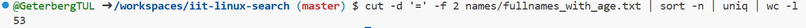
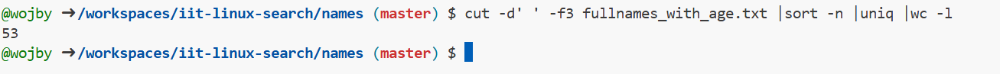
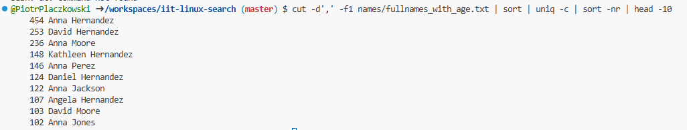
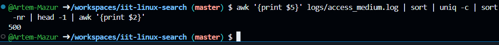
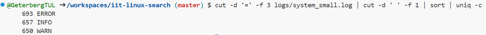
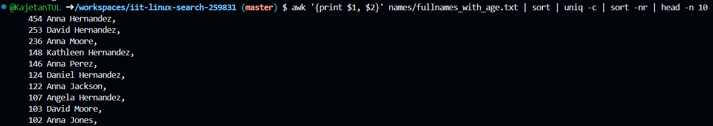
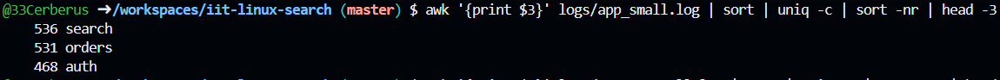

> This is the demonstration how to use Linux commands to process strutured text data.

### 0. How many lines are in fullnames_with_age.txt?

Put screenshot from Codespaces illustrating the result here.
Correct screenshot should contain your github username in the shell, a command and the result.

Example:

**Explanation** Write the explanation why the specific command was used.

Example: wc command is to count data in a given file. -l parameter is for counting lines.

### 1. How many lines in access_small.log have path /login?

Put screenshot from Codespaces illustrating the result here.
Correct screenshot should contain your github username in the shell, a command and the result.

**Explanation** Write the explanation why the specific command was used.

grep command used to filter lines with "/login", then wc -l to count lines with that element.

### 2. How many different ages are in fullnames_with_age.txt?

Put screenshot from Codespaces illustrating the result here.
Correct screenshot should contain your github username in the shell, a command and the result.

**Explanation** Write the explanation why the specific command was used.

cut is used to get only the age element from each line (' ' mean the space is the delimiter and 3 means the number of the column with ages), then sort is needed for uniq which in turn leaves out only unique elements. Finally wc -l counts lines with every unique age to determine the number.

### 3. How many unique first names are in fullnames_with_age.txt?

Put screenshot from Codespaces illustrating the result here.
Correct screenshot should contain your github username in the shell, a command and the result.

**Explanation** Write the explanation why the specific command was used.

cut used to get only first names, then sort in order to use uniq, which leaves only unique names, finally wc -l counts the lines where there is a unique name in every line.

### 4. Which age is most frequent in fullnames_with_age.txt?

Put screenshot from Codespaces illustrating the result here.
Correct screenshot should contain your github username in the shell, a command and the result.

**Explanation** Write the explanation why the specific command was used.

cut in order to get only the "age=x" part, then sorted so to use uniq -c, which leaves only unique ages and the number of their occurrences, sort -r to sort it by that number form largest to smallest, cut to leave out only the actual age and head -1 to get only the most frequent age.

### 5. Which username failed login most often in auth_small.csv?

Put screenshot from Codespaces illustrating the result here.
Correct screenshot should contain your github username in the shell, a command and the result.

**Explanation** Write the explanation why the specific command was used.

grep "FAIL" so the filter only leaves lines with that word, cut to get only the usernames, then sort and uniq -c to get the number of failed logins per username, finally sort -r to sort by that number from biggest to smallest and head -1 to print only the username that fails to login most often.

### 6. How many lines in system_small.log have ok=true?

Put screenshot from Codespaces illustrating the result here.
Correct screenshot should contain your github username in the shell, a command and the result.

**Explanation** Write the explanation why the specific command was used.

grep "ok=true" to get only lines containing the wanted phrase and wc -l to count those lines.

### 7, Which level (INFO, WARN, ERROR) appears most often in system_small.log?

Put screenshot from Codespaces illustrating the result here.
Correct screenshot should contain your github username in the shell, a command and the result.

**Explanation** Write the explanation why the specific command was used.

cut to get only the level from each line, then sort and uniq -c to acquire the number of times that level appears, sort -r to sort the occurrences biggest-to-smallest, cut again to get only the word describing the level and head -1 to print the most often appearing level.

### 8. What is the top 3 most common actions in app_small.log?

Put screenshot from Codespaces illustrating the result here.
Correct screenshot should contain your github username in the shell, a command and the result.

**Explanation** Write the explanation why the specific command was used.

double use of cut used to get only the names of actions, sort and uniq -c to get number of occurrences, sort -r to sort those numbers from biggest-to-lowest, head -3 to get the top 3 actions.

### 9. How many unique users are in app_small.log?

Put screenshot from Codespaces illustrating the result here.
Correct screenshot should contain your github username in the shell, a command and the result.

**Explanation** Write the explanation why the specific command was used.

grep "user=u" to get only lines where there were original users, cut to get just the users, sort and uniq to acquire just the unique users, grep "user" -c in order to get only lines with users and to count the number of original users.