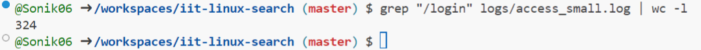
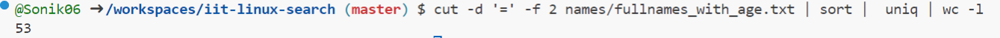
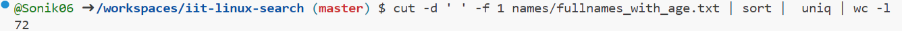
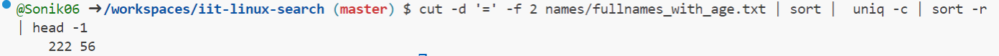
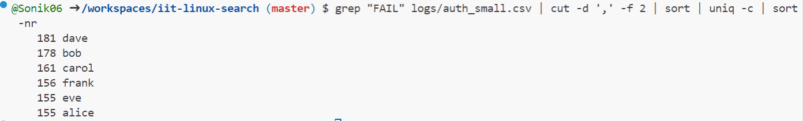
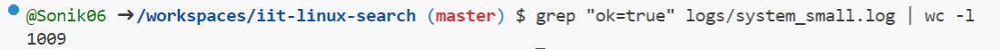
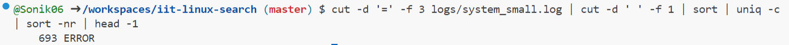
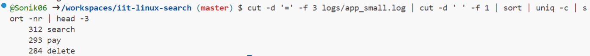
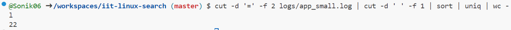

> This is the demonstration how to use Linux commands to process strutured text data.

### 0. How many lines are in fullnames_with_age.txt?

**Explanation**
wc command is to count data in a given file. -l parameter is for counting lines.

### 1. How many lines in access_small.log have path /login?

**Explanation**
I used grep command to filter lines that contain "/login". wc -l to count number of filtered lines.

---

### 2. How many different ages are in fullnames_with_age.txt?

**Explanation**
Used cut to extract only age section. sort and uniq to remove duplicates. wc -l to count number of lines.

---

### 3. How many unique first names are in fullnames_with_age.txt?

**Explanation**
Used cut to extract only name section. sort and uniq to remove duplicates. wc -l to count number of lines.

---

### 4. Which age is most frequent in fullnames_with_age.txt?

**Explanation**
Used cut to extract only age section. sort and uniq to remove duplicates. wc -l to count number of lines. sort -r to sort lines in descending order. head -1 to show only the most frequent age (first line).

---

### 5. Which username failed login most often in auth_small.csv?

**Explanation**
grep command to filter the lines that contain "FAIL". cut to extract username section. uniq -c to count occurences of each username. sort -nr to sort in descending order.

---

### 6. How many lines in system_small.log have ok=true?

**Explanation**
grep to filter lines that contain "ok=true". wc -l to count these lines.

---

### 7, Which level (INFO, WARN, ERROR) appears most often in system_small.log?

**Explanation**
I used cut command twice to get the level section. sort and uniq -c to count occurences for each level. sort -nr to sort lines in descending order. head -1 to show only the most frequent level.

---

### 8. What is the top 3 most common actions in app_small.log?

**Explanation**
I used cut command twice to get the action section. sort and uniq -c to count occurences for each action. sort -nr to sort lines in descending order. head -3 to show top 3 most common actions.

---

### 9. How many unique users are in app_small.log?

**Explanation**
I used cut command twice to get the user section. sort and uniq to remove duplicates. wc -l to count number of remaining unique values.

---
