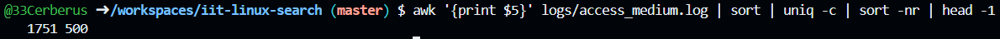
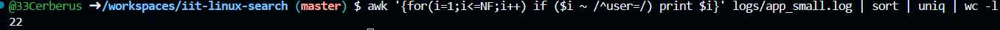

> This is the demonstration how to use Linux commands to process strutured text data.

### 0. How many lines are in fullnames_with_age.txt?

Put screenshot from Codespaces illustrating the result here.
Correct screenshot should contain your github username in the shell, a command and the result.

**Explanation** Write the explanation why the specific command was used.
Wc stands for word count and looks up the number of text data with -l it only shows number of lines.

### 1. How many lines in access_small.log have path /login?

Put screenshot from Codespaces illustrating the result here.
Correct screenshot should contain your github username in the shell, a command and the result.

**Explanation** Write the explanation why the specific command was used.
Grep is used to search for specific words in a file. A pipe "|" combines commands together. Wc is used to count text data with -l it shows only lines of text.
)
---

### 2. How many different ages are in fullnames_with_age.txt?

Put screenshot from Codespaces illustrating the result here.
Correct screenshot should contain your github username in the shell, a command and the result.

**Explanation** Write the explanation why the specific command was used.
Cut command lets you display chosen text seperated by a character in a line, | takes output of one command and inputs it to next command, uniq makes so only elements that don't repeat show up.
---

### 3. How many unique first names are in fullnames_with_age.txt?

Put screenshot from Codespaces illustrating the result here.
Correct screenshot should contain your github username in the shell, a command and the result.

**Explanation** Write the explanation why the specific command was used.
Cut command lets you display chosen text seperated by a character in a line, | takes output of one command and inputs it to next command, uniq makes so only elements that don't repeat show up.
---

### 4. Which age is most frequent in fullnames_with_age.txt?

Put screenshot from Codespaces illustrating the result here.
Correct screenshot should contain your github username in the shell, a command and the result.

**Explanation** Write the explanation why the specific command was used.
Cut command lets you display chosen text seperated by a character in a line, | takes output of one command and inputs it to next command, uniq makes so only elements that don't repeat show up and with -c it counts how many times a line appeared, sort -r sorts the numbers from highest to lowest, head -1 shows the first element.
---

### 5. Which username failed login most often in auth_small.csv?

Put screenshot from Codespaces illustrating the result here.
Correct screenshot should contain your github username in the shell, a command and the result.

**Explanation** Write the explanation why the specific command was used.
Grep prints only lines with fail in it, cut makes so only the names show up, uniq -c shows how many times a name shows up, sort -r sorts from the most frequent to the least, head -1 shows the first element.
---

### 6. How many lines in system_small.log have ok=true?

Put screenshot from Codespaces illustrating the result here.
Correct screenshot should contain your github username in the shell, a command and the result.

**Explanation** Write the explanation why the specific command was used.
Grep prints only lines with "ok=true", wc -l shows how many lines have "ok=true".
---

### 7, Which level (INFO, WARN, ERROR) appears most often in system_small.log?

Put screenshot from Codespaces illustrating the result here.
Correct screenshot should contain your github username in the shell, a command and the result.

**Explanation** Write the explanation why the specific command was used.
Cut command lets you display chosen text seperated by a character in a line, | takes output of one command and inputs it to next command, uniq makes so only elements that don't repeat show up and with -c it counts how many times a line appeared, sort -r sorts the numbers from highest to lowest, head -1 shows the first element.
---

### 8. What is the top 3 most common actions in app_small.log?

Put screenshot from Codespaces illustrating the result here.
Correct screenshot should contain your github username in the shell, a command and the result.

**Explanation** Write the explanation why the specific command was used.
Cut command lets you display chosen text seperated by a character in a line, | takes output of one command and inputs it to next command, uniq makes so only elements that don't repeat show up and with -c it counts how many times a line appeared, sort -r sorts the numbers from highest to lowest, head -3 shows the first 3 elements.
---
---

### 9. How many unique users are in app_small.log?

Put screenshot from Codespaces illustrating the result here.
Correct screenshot should contain your github username in the shell, a command and the result.

**Explanation** Write the explanation why the specific command was used.
Cut command lets you display chosen text seperated by a character in a line, | takes output of one command and inputs it to next command, uniq makes so only elements that don't repeat show up. wc -l prints the number of lines/users.
---